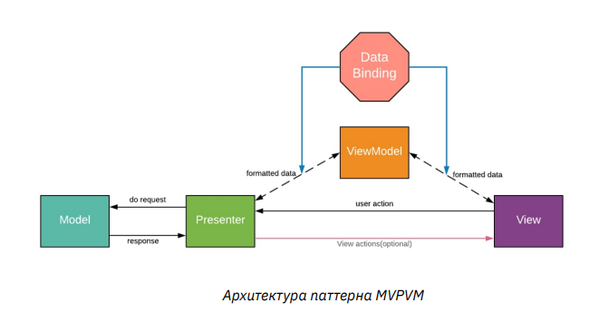
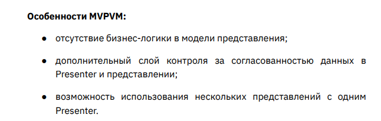

Model-View-Presenter-ViewModel

**model** - бизнес логика. \
**view** - интерфейс пользователя. \
**viewModel** - формирует данные из модели для отображения во View.
Переделывает сырые данные в нужный формат отображения.\

