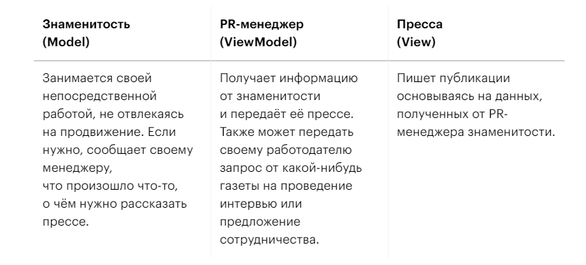

**model** - бизнес логика. \
**view** - интерфейс пользователя. \
**viewModel** - медиатор между ними, получает данные из модели и передает их в интерфейс
также обрабатывает данные из интерфейса и передает в действия, которые выполняются в модель.
Позволяет изменять логику без изменения бизнес логики.
Тут View получает только результат.
Все работу ведет ViewModel.

В конкретно это программе класс Book содержит два поля. 
Первое это имя книги, второе это прочитана она или нет. 
По умолчанию не прочитана. Три метода, первый маркирует книгу как прочитанную, меняя false на true.
Геттер по получению статуса книги. И переопределенный метод toString.

Класс BooksViewModel тот тот самый медиатор, который производит действие над данными в Model, к примеру меняя
у книги статус в методе markBookAsRead(int index). И меняет в списке книг их статус и отдает обратно для View.
View же просто забирает у пользователя данные и выводит новые (System.out.print(viewModel.getDisplayableBooks());)